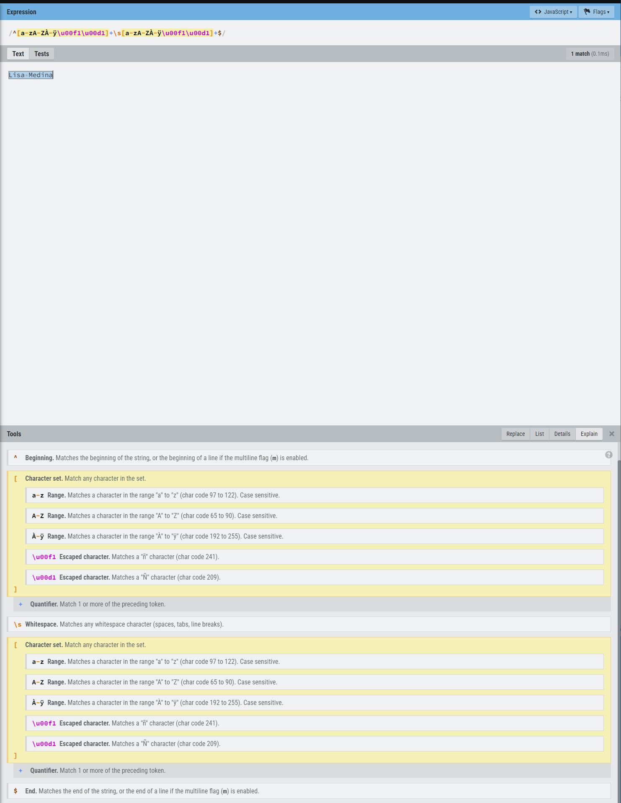

# LAB | Java Excepciones

## Introducción

Acabamos de aprender cómo throw (lanzar), manejar y probar excepciones, así que practiquemos un poco más.

 

## Requisitos

1. Haz un fork de este repositorio.
2. Clona este repositorio.
3. Añade a tu instructor y a los calificadores de la clase como colaboradores de tu repositorio. Si no estás seguro de quiénes son los calificadores de tu clase, pregunta a tu instructor o consulta la presentación del primer día.
4. En el repositorio, crea un proyecto de Java y añade el código para las siguientes tareas.

## Entrega

Una vez que termines la tarea, envía un enlace URL a tu repositorio o tu solicitud de extracción en el campo de abajo.

 

## Instrucciones

1. Crea una clase `Person` que tenga las siguientes propiedades:
   - `id`: un número entero
   - `name`: una cadena formateada como "nombreApellido"
   - `age`: un número entero
   - `occupation`: una cadena

   La clase `Person` debería tener los siguientes métodos:
   - Un constructor que tome un número entero `id`, una cadena `name`, un número entero `age` y una cadena `occupation` como argumentos y establezca sus propiedades respectivas.
   - Un método `setAge` que tome un número entero `age` y establezca la propiedad `age`, pero lance un error si `age` es menor que 0.
   - Un método `equals` que tome un objeto `Person` y devuelva `true` si sus propiedades son iguales, excluyendo la propiedad `id`.

2. Crea una clase `PersonsList` que contenga una lista de objetos `Person`.
   - Crea un método `findByName` que tome una cadena `name` y devuelva el objeto `Person` con un `name` que coincida exactamente. El parámetro `name` debería estar formateado como "firstName lastName". Este método debería lanzar una excepción si el parámetro `name` no está formateado adecuadamente.
   - Crea un método `clone` que tome un objeto `Person` y devuelva un nuevo objeto `Person` con las mismas propiedades, excepto con un nuevo `id`.
   - Crea un método que tome un objeto `Person` como parámetro y use el método `toString` para escribir la información de `Person` en un archivo. Este método debería manejar cualquier error necesario.

   

## Casos de test

1. Prueba el método `setAge` para asegurarte de que lanza un error si la edad es menor que 0.
2. Prueba el método `findByName` para asegurarte de que encuentra y devuelve correctamente el objeto `Person` correcto cuando se le da un nombre correctamente formateado.
3. Prueba el método `findByName` para asegurarte de que lanza una excepción si el parámetro `name` no está formateado correctamente.
4. Prueba el método `clone` para asegurarte de que crea un nuevo objeto `Person` con las mismas propiedades que el original, excepto con un nuevo `id`.

## REGEX:

- [Useful tool to test a regex and see explanation](https://regexr.com/2tm4f) 
- [Regular expressions](https://www.baeldung.com/regular-expressions-java) 

 